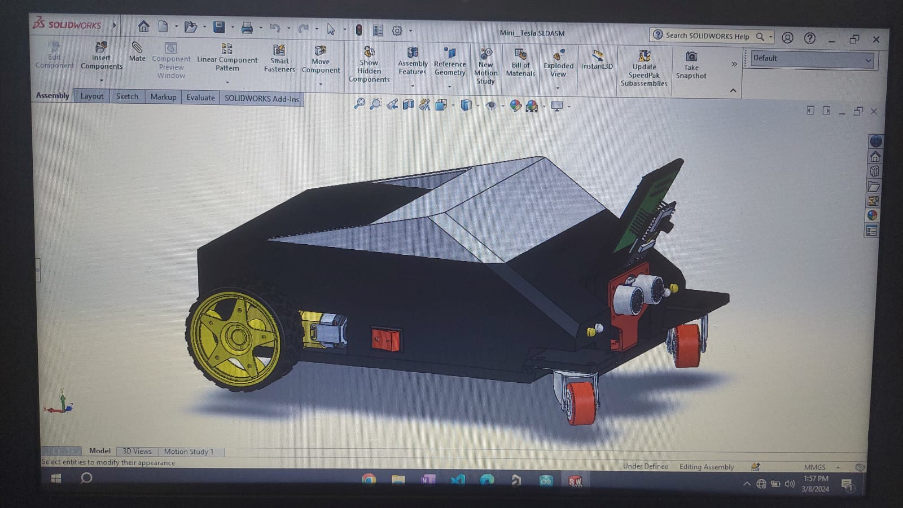

 

# CyberDrive: Self-Driving Car Project with Python

CyberDrive is an ambitious project aimed at developing a self-driving car prototype inspired by the innovative technology of the Tesla Cybertruck. Leveraging Python and ESP32CAM, CyberDrive integrates cutting-edge computer vision algorithms to process real-time images and drive autonomously, mimicking the functionalities of advanced automotive technologies.

## Demonstration: [Watch the demo video](Assets/Demo/Video%20Demo.mp4)

https://github.com/Choaib-ELMADI/cyberdrive/assets/111356633/bb55ab61-e796-419e-888f-d1f75af9644b

## Project Goals:

- `Autonomous Navigation`: Implement computer vision algorithms to enable the car to navigate and make decisions based on real-time visual inputs, paving the way for autonomous driving capabilities.

- `Road Sign Detection`: Utilize machine learning models to detect and interpret road signs, ensuring adherence to traffic regulations and enhancing overall safety.

- `Vehicle Distance Calculation`: Develop algorithms to accurately calculate distances to other vehicles on the road, facilitating safe following distances and collision avoidance.

## Key Features:

- `Computer Vision Integration`: Integrate computer vision libraries such as OpenCV for real-time image processing and analysis.

- `Machine Learning Model Training`: Train custom machine learning models to recognize and interpret road signs..

- `ESP32CAM Integration`: Utilize ESP32CAM for capturing and streaming real-time video footage, enabling seamless integration with the self-driving car system.

- `Tesla Cybertruck Inspiration`: Take inspiration from the revolutionary design and technology of the Tesla Cybertruck to create a futuristic and robust self-driving car prototype.

## How It Works:

- `Image Processing`: ESP32CAM captures live video feed from the car's surroundings, which is processed in real-time using Python-based computer vision algorithms.

- `Road Sign Detection`: Trained machine learning models analyze the video feed to detect and interpret various road signs, providing crucial information for navigation and decision-making.

- `Distance Calculation`: Advanced algorithms calculate distances to other vehicles on the road, ensuring safe driving practices and collision avoidance maneuvers.

CyberDrive represents a groundbreaking endeavor in the field of self-driving car technology, combining innovation, machine learning, and real-world applications to create a safer and more efficient transportation future.
